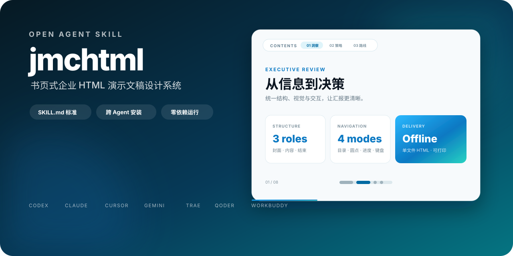

# jmchtml



`jmchtml` is an Agent Skill for creating polished, book-like HTML presentation decks for enterprise reporting. It defines a reusable page structure, design tokens, branded navigation, fullscreen behavior, print rules, and a delivery checklist.

## Quick install

With the Agent Skills CLI:

```bash
npx skills add pherehouse/jmchtml -s jmchtml -a codex -g -y
```

Replace `codex` with any target supported by the Skills CLI.

For other agents, ask the agent to install the Skill from this repository:

```text
Install the jmchtml Skill from https://github.com/pherehouse/jmchtml.
Copy the entire skills/jmchtml/ directory to your user-level Skills directory.
Back up any existing copy before replacing it, then verify SKILL.md and report the path.
```

## Use

```text
Use jmchtml to turn the Markdown report in this directory into an offline,
single-file HTML presentation. Include the floating table of contents,
progress navigation, keyboard controls, logo fullscreen toggle, and print styles.
```

The Skill is written in Chinese because its primary use case is Chinese enterprise reporting. Agents that can follow Chinese instructions can use it directly.

## Supported agents

OpenAI Codex, Claude Code, Cursor, Gemini CLI, GitHub Copilot, TRAE, Qoder, WorkBuddy, QoderWork, TraeCode CLI, and other agents that support the shared `SKILL.md` format.

See the [Chinese README](README.md) for the installation prompt, safety notes, and project details.

## License and trademarks

Code and documentation are released under the [MIT License](LICENSE). JMC, Ford, and related marks remain the property of their respective owners. The bundled logo asset is not separately licensed under MIT; replace it when you do not have permission to use the brand. See [NOTICE](NOTICE).
